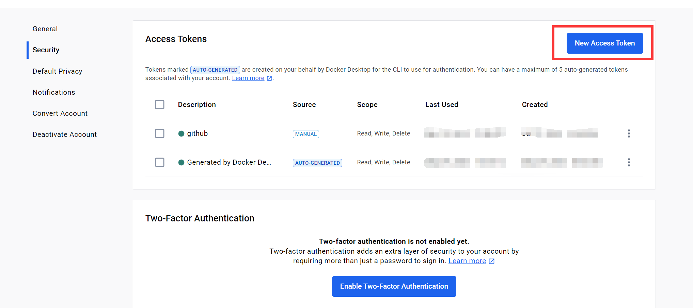
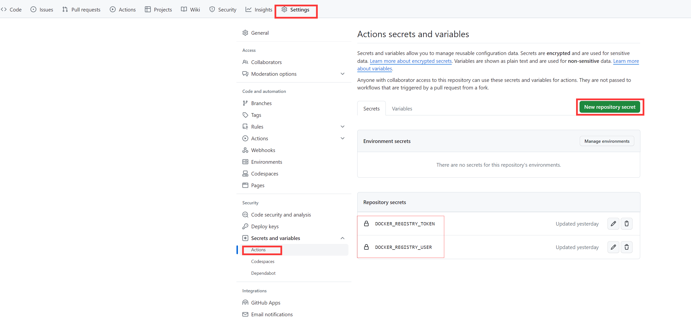

# HuggingFaceAnt

利用github的actions构建docker，并推送镜像到dockerhub,本地拉取docker image后导出模型文件

# 用法

## Fork 本仓库

点此 [Fork](https://github.com/login?return_to=%2Fgo-laoji%2FHuggingFaceAnt) 仓库

## 修改配置

* 配置docker hub的`token` 在此[连接](https://hub.docker.com/settings/security),参考下图
  
* 配置fork后的仓库`Actions secrets` 参考下图
  
* [docker.yml](.github/workflows/docker.yml#L23) 替换你自己的docker hub用户名`xxx/HuggingFaceAnt`
* 指定你要拉取的模型ID需要修改[Dockerfile](Dockerfile#L5) `ENV repo_id=bert-base-chinese`
* 提交代码修改，github会自动触发`Actions`任务，完成镜像构建并推送到dockerhub

## 本地运行docker

    docker run -it -v ./:/data [xxx/HuggingFaceAnt]

指定的模型文件会拷贝到当前指定的`volume`目录下